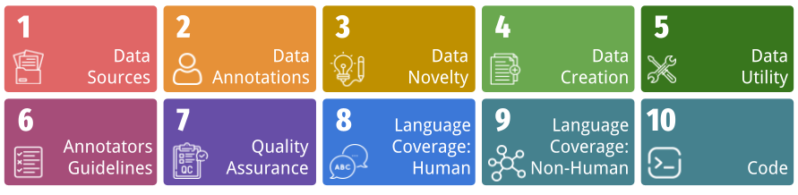

# DataRubrics

  
  
  

  
  

## Quick Start

For performing OCR, do `pip install -r requirements_olmocr.txt`.

On the other hand, for performing rubric generation, do `pip install -r requirements_inference.txt`.

